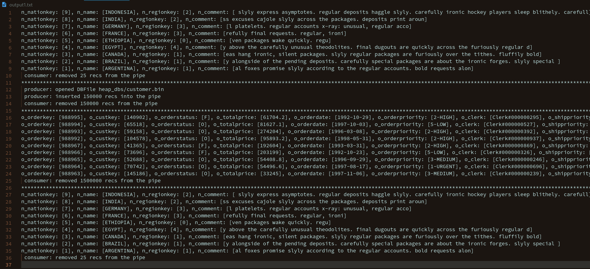
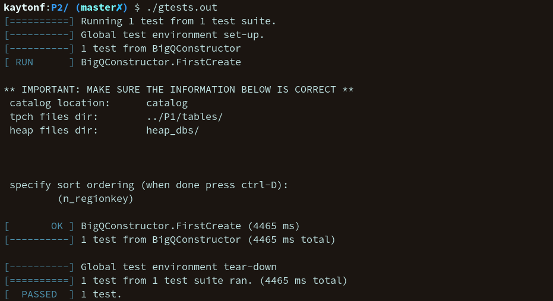

# P2 - Part 1: The BigQ Class

Group Members: Kayton Fletcher

The bulk of the implementation for project 2 part 1 is within `BigQ.cc` and `BigQ.h`. 

`BigQ::BigQ(Pipe, Pipe, OrderMaker, int runlen)`
This `BigQ` constructor initializes BigQ state variables and starts a worker thread using `std::thread`, which is given the member function `readAndSort` to execute.

`readAndSort`
This function gets records from the `in Pipe` and creates sorted runs of pages of these records, writing them to `sortfile.bin`. It creates a vector of `RunInfo` structs to keep track of metadata about each run to be merged later. At the end it calls `merge`.

`merge(vector<RunInfo>)`
Using the runInfo and the file where the sorted runs were written, this function builds a priorty queue over the heads of each run, going through each record and globally sorting them.

`BigQ::~BigQ`
The destructor simply joins and deletes the worker thread.


## Assumptions
It is assumed that both `bison` and `flex` are installed to compile the parser needed. Additionally, gtest must be installed as a library that can be linked on the system, as I only specify `-lgtest` within the `Makefile` and will not be providing the program with my submission.

The needed files `catalog`, `Lexer.l` and `Parser.y` have been included in the zip file.

One should ensure `dbfile_dir`, `tpch_dir`, and `catalog_path` are all set to the desired location.

I have not made any adjustments to `test.cc` or `main.cc`: thus running the main executable will not invoke my `DBFile` class at all. Instead, I have used `test.cc` to load heap databases created with the `DBFile` class created in Project 1, and from there sort the database and print/write the results.

Finally, many adjustments were made to the starter code provided, and as such I am expecting the files I have provided to be used when compiling my `DBFile` and `BigQ` class.

## Compiling The Programs
To compile `test.out`, the program that runs test.cc as provided, run the following command
``` 
make test.out
```
To compile `gtests.out`, the program that runs the unit tests I wrote, run the command
```
make gtests.out
```

Similarly, running `make main` compiles the main program, that does not test my functionality at all.

## Running The Programs
Running the programs is very straight forward. Treat each as an executable.

`./test.out`, `./gtests.out`, and `./main`

Both `gtests.out` and `test.out` require user input. For `gtests.out`, it will require a sort order to be provided for nation.bin. The location of the nation.bin heap database will also need to be updated for the test case to pass.

The unit tests created with gtest are all located in `gtests/main.cc`. The gtests created are simple and only test the BigQ constructor as requested. It was not possible to test the other member functions, as calling the BigQ constructor automatically spawns a thread that calls them.

## output1.txt Output
The output for running the shell script `runDBTestCases.sh` is shown below:




## Gtest Output


