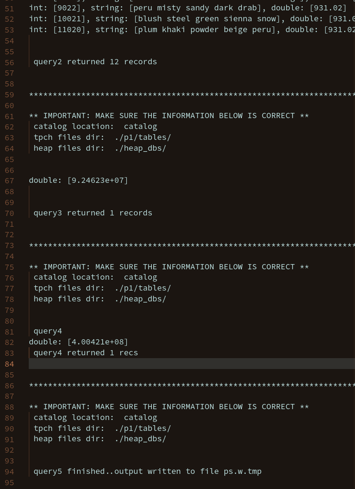
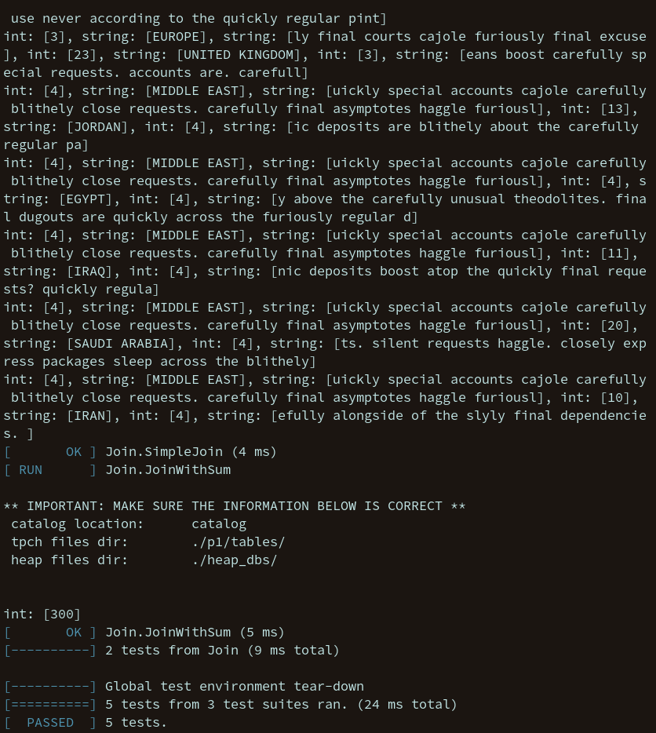

# P3: Database Operations

Group Members: Kayton Fletcher

The bulk of the implementation for project 3 is within the `relational_ops` folder within the project directory. This folder is where I made a class (and therefore an associated header and .cc file) for every operation required to perform database queries, as requested in the specification. 


For this project I overhauled test.h to remove many of the bad practices and annoyances it had. To do this I used `inline`, so this project *must be compiled with c++17*. Similarly, changes were made to project 3's test.cc to work with the changed header file.

I also greatly restructured the file layout into directories to organize the unwieldy number of files in the project. I did this before reading the mention in the announcement to not do this. This makefile should ensure this still works with a script, as it compiles the `test.out` executable. 

Each operation created spawns a worker thread that can be joined by calling the specific `Relation::WaitUntilDone()` function. Each operation also has an associated `Run` function that spawns the thread and performs a calculation. The operations implemented include `Join`, `SelectPipe`, `SelectFile`, `DuplicateRemoval`, `GroupBy`, `Project`, and `Sum`. There is also an operation to write records out to a file in a nice format, namely `WriteOut`.

## Assumptions
It is assumed that both `bison` and `flex` are installed to compile the parser needed. Additionally, gtest must be installed as a library that can be linked on the system, as I only specify `-lgtest` within the `Makefile` and will not be providing the program with my submission.

The needed files `catalog`, `Lexer.l`, `LexerFunc.l`, `ParserFunc.y` and `Parser.y` have been included in the zip file. They are found within the `dependencies` subdirectory.

The variables `dbfile_dir`, `tpch_dir`, and `catalog_path` now have their values derived from the `test.cat` file found in the projects root directory. If `test.h` is not present, default values are given for the static variables in `test.h`.

Finally, many adjustments were made to the starter code provided, and as such I am expecting the files I have provided to be used when compiling my DB classes.

## Compiling The Programs
To compile `test.out`, the program that runs test.cc as provided, run the following command
``` 
make test.out
```
To compile `gtests.out`, the program that runs the unit tests I wrote, run the command
```
make gtests.out
```

No `main.cc` was submitted with this project, other than the one in the `gtests` folder.

## Running The Programs
Running the programs is very straight forward. Treat each as an executable.

`./test.out` and `./gtests.out`.

Neither executable requires user input. However, `test.out` must have a command line argument for which test you wish to run. `gtests.out` does need a valid location for the HeapDB for the `nation` and `region` relations.

The unit tests created with gtest are all located in `gtests/main.cc`. The gtests created test the operations created.

## ./runTestCases.sh Output


## Gtest Output

