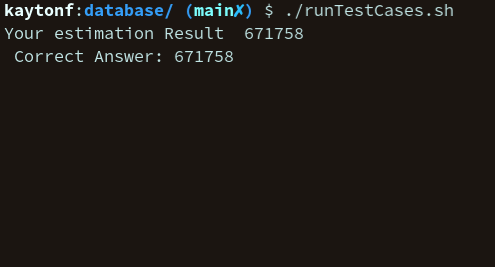
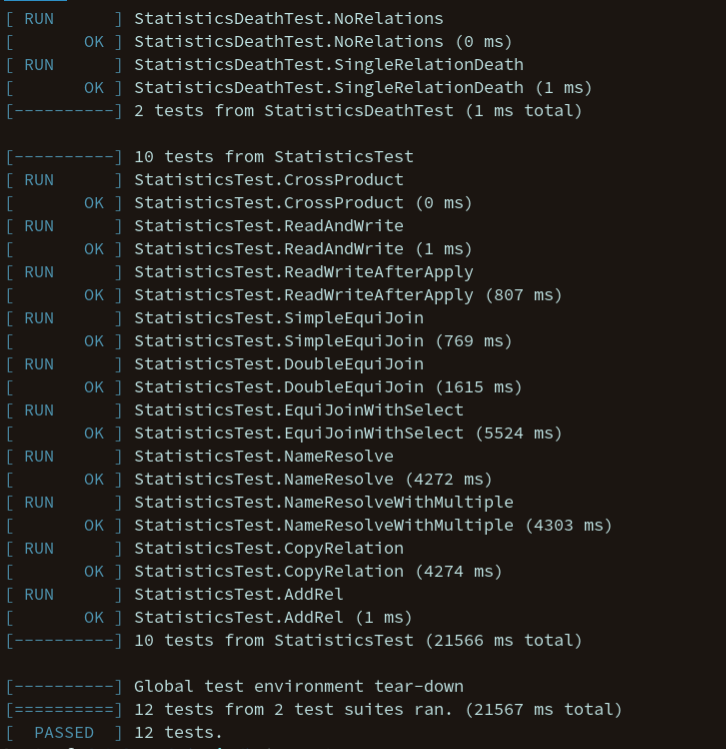

# P4 Part 1: Query Estimation

Group Members: Kayton Fletcher

The implementation for project 4 part 1 is found in the subdirectory `statistics`, within the project directory. This directory is where I made the `Statistics` class, along with many helper classes that manage the joins, relations and attributes that are used to compute statistics. 

This project *must be compiled with c++17* due to the use of inline, std::variant and other c++17 features. Some things within test.cc were altered to ensure the program ran succesfully. Additionally, the estimations within `test.cc` were changed to match the values my statistics came up with, as the values vary compared to the original provided values. 

I also greatly restructured the file layout into directories to organize the unwieldy number of files in the project. I did this before reading the mention in the announcement to not do this. This makefile should ensure this still works with a script, as it compiles the `a4-1.out` executable. 

Most notably, the structs I use are `JoinStat`, `RelationStat`, and `AttributeStat`, where a join holds a list of relations, a relation holds a map of attributes and attributes hold a histogram for counts of that specific attribute.

## Statistics

Statistics are written out in a straightforward manner. First, the number of joins is written on the first line. From there, the next line has join information written to it, including the join ID, the number of join tuples, the join probability (percentage of join tuples actually selected), and the number of relations. The number of relations value is then used to get each relation in the join next. Getting the relations name, the number of tuples and the number of attributes. Each attribute then has its number of tuples, number of distinct and histogram written. I have limited each line to 10,000 attribute values. And a histogram stores at most 100,000 values in total.

## Assumptions
It is assumed that both `bison` and `flex` are installed to compile the parser needed. Additionally, gtest must be installed as a library that can be linked on the system, as I only specify `-lgtest` within the `Makefile` and will not be providing the program with my submission.

The needed files `catalog`, `Lexer.l`, `LexerFunc.l`, `ParserFunc.y` and `Parser.y` have been included in the zip file. They are found within the `dependencies` subdirectory.

The variables `dbfile_dir`, `tpch_dir`, and `catalog_path` now have their values derived from the `test.cat` file found in the projects root directory. If `test.cat` is not present, default values are given for the static variables found in `Statistics.h` for where the database files can be found.

Finally, many adjustments were made to the starter code provided, and as such I am expecting the files I have provided to be used when compiling my DB classes.

## Compiling The Programs
To compile `a4-1.out`, the program that runs test.cc as provided, run the following command
``` 
make a4-1.out
```
To compile `gtests.out`, the program that runs the unit tests I wrote, run the command
```
make gtests.out
```
To compile `a2test.out`, the program that enables the creation of heap and sorted databse *.bin files
```
make a2test.out
```

No `main.cc` was submitted with this project, other than the one in the `gtests` folder.

## Running The Programs
Running the programs is very straight forward. Treat each as an executable.

`./a4-1.out` and `./gtests.out`.

Neither executable requires user input. However, `a4-1.out` must have a command line argument for which test you wish to run. `gtests.out` does need the correct location of the catalog and database files created from `a2test.out`, as specified in `test.cat`.

The unit tests created with gtest are all located in `gtests/main.cc`. The gtests created test the ability to estimate various queries using a mixture of joins and selects.
It also tests the read, write and copy relation functionality of the Statistics class.

To run the program that enables database creation, simply run `./a2test.out`. From there you may choose option 1 to create a sorted database or option 2 to create a heap database. For either, you must specify the relation you wish to create. Both use the locations specified in `test.cat` to retrieve and write files. For sorted files, you must also specify the run length and sorting order desired. 

## ./runTestCases.sh Output


## Gtest Output

